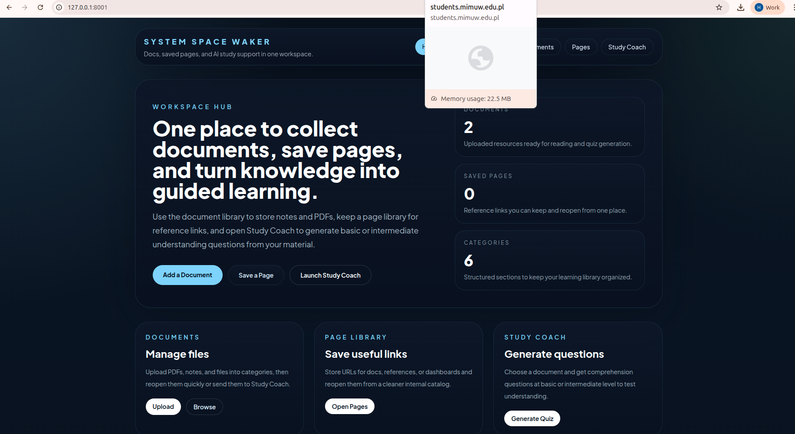
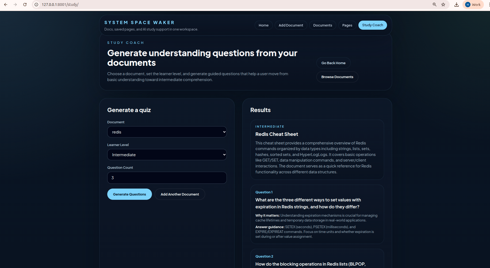

# System Space Waker learn more

System Space Waker is a Django app for organizing documents, saving reference pages, and generating study questions from uploaded content.



## Features

- Upload and organize documents by category
- View saved documents from a central library
- Save useful URLs and reopen them in an embedded page viewer
- Generate basic or intermediate understanding questions from documents
- Run the app with Docker Compose and PostgreSQL

## Project Modules

- `Documents`: upload files, categorize them, and browse the library
- `Pages`: save external URLs and render them inside the app when embedding is allowed
- `Study Coach`: read a document and generate guided comprehension questions using SambaNova



## Tech Stack

- Django 6
- PostgreSQL
- Docker Compose
- Tailwind via CDN
- SambaNova SDK
- `pypdf` for PDF text extraction

## Local Configuration

Create or update `.env` in the project root:

```env
DJANGO_DEBUG=True
DJANGO_ALLOWED_HOSTS=localhost,127.0.0.1,0.0.0.0
DJANGO_SECRET_KEY=your-secret-key
APP_PORT=8001

DATABASE_NAME=systemspacewaker
DATABASE_USER=postgres
DATABASE_PASSWORD=postgres
DATABASE_HOST=db
DATABASE_PORT=5432

SAMBANOVA_API_KEY=your_api_key_here
SAMBANOVA_BASE_URL=https://api.sambanova.ai/v1
SAMBANOVA_MODEL=DeepSeek-V3.1
```

You can also copy values from `.env.example`.

## Run With Docker

From the `systemspacewaker/` folder:

```bash
docker compose up --build -d
```

The app will be available at:

- `http://127.0.0.1:8001/`

Useful commands:

```bash
docker compose logs -f web
docker compose down
```

## Run Without Docker

Create a virtual environment and install dependencies:

```bash
python -m venv venv
source venv/bin/activate
pip install -r requirements.txt
```

Run migrations and start the server:

```bash
python manage.py migrate
python manage.py runserver
```

## Main Routes

- `/` : home dashboard
- `/add_document/` : upload a new document
- `/documents/` : browse uploaded documents
- `/pages/` : save and manage page links
- `/study/` : generate questions from documents

## Notes

- PDF quiz generation depends on `pypdf`
- Some websites block iframe embedding, so saved pages may need to be opened in a new tab
- Study Coach needs a valid `SAMBANOVA_API_KEY` to generate questions
